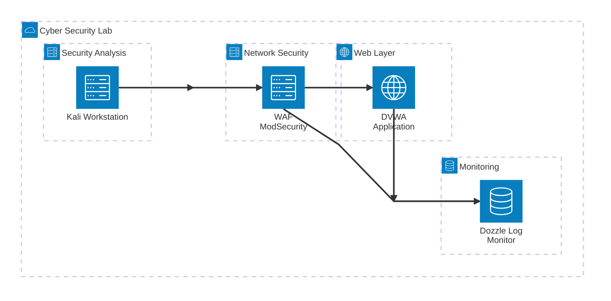

# Formação em Cybersecurity - Módulo 2 🚀

## 🛠️ Descrição do Projeto
| Este projeto foi desenvolvido como parte do **[Módulo 2 da Trilha de Formação em Cybersecurity](https://github.com/Kensei-CyberSec-Lab/formacao-cybersec/tree/main/modulo2-defesa-monitoramento/projeto-final)**.  |
|:---:|
| |
| **<a href="/doc/Desafio_Modulo_02-Projeto_01-v.1.0.pdf" target="_blank">Clique no book para baixar a versão detalhada!** |
|  |
|   |

> [!NOTE]
> **CURSO FORMAÇÃO CIBERSEC**
> 
> ***Autor:*** Claudio Mendonça - ***Data:*** 15/09/2025 - ***Versão:*** 1.0
>
> **Mestre:** [Jose Menezes](https://github.com/jcarlos78) - **Instrutores:** [Gilson Andrade](https://github.com/GilsonJunio) / [João Pedro Belo](https://github.com/silvajpedro)
 
# Formação em Cybersecurity - Módulo 2 🚀

---
---

## 📖 Sumário

1. [Sumário Executivo](#sumario-executivo)

# Diagrama de Arquitetura - Sistema de Segurança Cibernética

Este diagrama representa a arquitetura de um sistema real de laboratório de segurança cibernética, incluindo WAF (Web Application Firewall), aplicação vulnerável para testes, estação de trabalho para análise de segurança e sistema de monitoramento de logs.

## Mapeamento de Endereços IP

| Componente | Endereço IP | Porta | Acesso |
|------------|-------------|-------|---------|
| **Kali Workstation** | 192.168.35.11 | - | Terminal/SSH |
| **WAF ModSecurity** | 192.168.35.30 | 8080 | http://localhost:8080 |
| **DVWA Application** | 192.168.35.40 | 80 | (via WAF) |
| **Dozzle Log Monitor** | 192.168.35.50 | 9999 | http://localhost:9999 |

**Subnet:** 192.168.35.0/24

## Componentes do Sistema

### Segurança de Rede
- **WAF ModSecurity**: Web Application Firewall baseado no OWASP ModSecurity Core Rule Set
  - Modo de operação: DetectionOnly (apenas detecção, sem bloqueio)
  - Níveis de paranoia: 1 (balanceado)
  - Proxy reverso para a aplicação web

### Camada Web
- **DVWA Application**: Damn Vulnerable Web Application
  - Aplicação web intencionalmente vulnerável para testes de segurança
  - Utilizada para treinamento e demonstração de vulnerabilidades

### Análise de Segurança
- **Kali Workstation**: Estação de trabalho especializada em segurança
  - Ferramentas instaladas: nmap, gobuster, sqlmap, tcpdump
  - Utilizada para testes de penetração e análise de segurança

### Monitoramento
- **Dozzle Log Monitor**: Sistema de monitoramento de logs em tempo real
  - Interface web para visualização de logs
  - Monitoramento centralizado de todos os componentes

## Fluxo de Dados

1. **Análise de Segurança**: A estação Kali executa testes de segurança
2. **Proteção WAF**: Todo tráfego passa pelo WAF ModSecurity
3. **Aplicação Alvo**: Requisições chegam à aplicação DVWA
4. **Monitoramento**: Logs de todos os componentes são coletados pelo Dozzle

## Configuração de Rede

- **Subnet**: 192.168.35.0/24
- **WAF ModSecurity**: 192.168.35.30:8080
- **DVWA Application**: 192.168.35.40:80
- **Kali Workstation**: 192.168.35.11
- **Dozzle Monitor**: 192.168.35.50:9999

## Portas de Acesso

- **WAF/DVWA**: http://localhost:8080
- **Monitoramento**: http://localhost:9999 (admin/admin)
